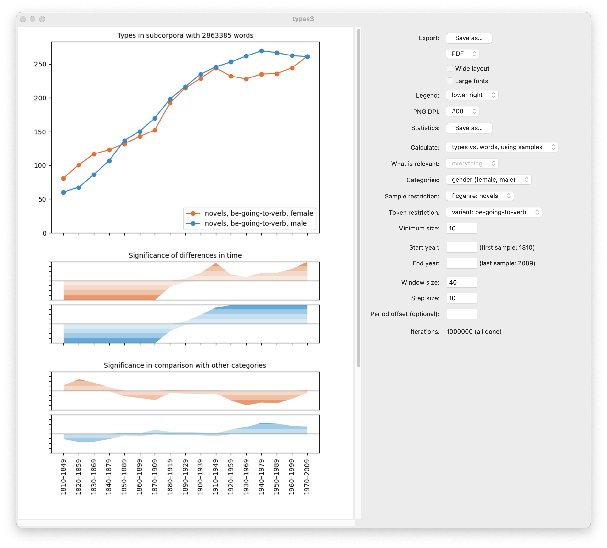

# types3: Type accumulation curves

This is a tool for analyzing textual diversity, richness, and productivity in text corpora and other datasets.

## References

This tool has been used in:

- Margherita Fantoli, Jukka Suomela, Toon Van Hal, Mark Depauw, Lari Virkki, and Mikko Tolonen (2025): "Quantifying the Presence of Ancient Greek and Latin Classics in Early Modern Britain." *Journal of Cultural Analytics*, volume 10, issue 1. [doi:10.22148/001c.128008](https://doi.org/10.22148/001c.128008)
- Tanja Säily, Florent Perek, and Jukka Suomela (2025): "Variation and Change in the Productivity of BE *going to* V in the *Corpus of Historical American English*, 1810–2009." *English Language and Linguistics*, volume 29, issue 2 (special issue, Tanja Säily & Turo Vartiainen (eds.), *Constructional Approaches to Creativity and Productivity in English*). [doi:10.1017/S136067432500022X](https://doi.org/10.1017/S136067432500022X)

## Setup

You will need a Unix-like operating system, Python with Tkinter support, and Rust. See below for detailed instructions for your operating system.

### macOS

Open a terminal.

Make sure you have Homebrew installed and up to date:

- Run `brew update` and `brew upgrade` and see if it works.
- If not, follow the usual [Homebrew installation instructions](https://brew.sh).
- After installation, you can close and re-open the terminal.

Make sure you have the relevant packages installed by running this command:

    brew install python python-tk

Make sure you have Rust installed and up to date:

- Run `rustup update` and see if it works.
- If not, follow the usual [Rust installation instructions](https://www.rust-lang.org/tools/install). You need to copy and paste one command into the terminal and follow the instructions (all default settings are fine).
- After installation, you can close and re-open the terminal.

Download and set up types3:

    git clone https://github.com/suomela/types3.git
    cd types3
    util/setup.sh

Try it out with our sample dataset:

    ./types3-ui sample-data/ceec.json

### Ubuntu Linux

Open a terminal.

Make sure you have the relevant packages installed by running these commands:

    sudo apt-get update
    sudo apt-get install git curl build-essential python3 python3-venv python3-tk

Make sure you have Rust installed and up to date:

- Run `rustup update` and see if it works.
- If not, follow the usual [Rust installation instructions](https://www.rust-lang.org/tools/install). You need to copy and paste one command into the terminal and follow the instructions (all default settings are fine).
- After installation, you can close and re-open the terminal.

Download and set up types3:

    git clone https://github.com/suomela/types3.git
    cd types3
    util/setup.sh

Try it out with our sample data set:

    ./types3-ui sample-data/ceec.json

### Windows

Install [WSL](https://learn.microsoft.com/en-us/windows/wsl/install) (Windows Subsystem for Linux) if you do not have it yet:

- Open a terminal.
- Run `wsl --install` to install WSL.
- Restart the computer when instructed to do so.
- Open "Ubuntu" (from the Start menu).
- Follow the instructions to set your Linux username and password.

You now have Ubuntu Linux running on your Windows computer, and you can follow the instructions for Ubuntu Linux above. Just make sure that you run all commands inside "Ubuntu" (and not, e.g., in the regular Windows terminal).

## Usage

If you have input data in `data.json`, you can start to explore it with:

    ./types3-ui data.json

For more information, see:

    ./types3-ui --help
    ./types3-convert --help
    ./types3-filter --help
    ./types3-calc --help
    ./types3-plot --help
    ./types3-stat --help

## Data format

See [data-format](data-format) for more information on the data format and how to convert your own data into the right format.

## Sample data

See [sample-data](sample-data) for our sample datasets. To explore our sample datasets, try:

    ./types3-ui sample-data/ceec.json

and:

    ./types3-ui sample-data/ced-ppceme-chelar.json

## Creating subcorpora

This program lets you create a subcorpus in an interactive manner:

    ./types3-filter input.json output.json

Try, for example:

    ./types3-filter sample-data/ced-ppceme-chelar.json subcorpus.json

And once you have created a subcorpus:

    ./types3-ui subcorpus.json

## Tests

To run all automatic tests, you will also need to have ImageMagick installed:

- On Ubuntu Linux run `apt-get install imagemagick`
- On macOS run `brew install imagemagick`

Depending on your operating system, you may also need to [adjust ImageMagick security policy](https://stackoverflow.com/questions/52998331/imagemagick-security-policy-pdf-blocking-conversion) to enable PDF-to-PNG conversion.

Then run:

    util/test.sh

## Prior versions

- [types2](https://github.com/suomela/types): type and hapax accumulation curves
- [TypeRatio](https://github.com/suomela/type-ratio): comparing competing suffixes

## Author

- [Jukka Suomela](https://jukkasuomela.fi/), Aalto University

## Acknowledgements

Thanks to [Paula Rodríguez-Puente](https://www.usc-vlcg.es/PRP.htm) and [Tanja Säily](https://tanjasaily.fi/) for help with developing these tools.
